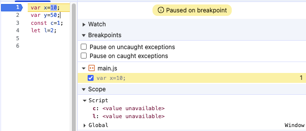
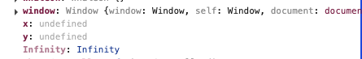

## Scope

### scope란
- 각 식별자의 유효 범위( Global Scope, Function Scope, Block Scope )

### lexical scope
- lexical 뜻 
  - 어휘의, 단어의
- lexical scope 뜻
  - 코드가 작성된 위치에 따라 결정되는 스코프
  - 함수가 어디서 호출되었는지가 아니라, 어디에 정의되었는지에 따라 스코프가 결정됨 : 정의된 위치 기반
  - 중첩된 함수는 자신이 정의된 위치의 스코프를 기억함 

C나 JAVA는 Dynamic Scope(동적 스코프)를 사용
: 함수를 호출했을때 function object로 등록된다

반면 JavaScript는 Static Scope(정적 스코프)를 사용
: 함수를 정의한 위치에서 function object로 등록된다


identifier resolution(식별자를 찾아가는 과정)
: local (function/block) scope -> outer (enclosing) scope -> global scope

실행 컨텍스트(Execution Context)

memory 생성 단계와 와 execution(code) - 실행단계로 나뉨
- memory 생성단계
1. 전역 객체 생성 (browser: window, node: global)
2. this 바인딩 (전역에서는 전역 객체를 가리킴)
3. 함수들과 변수들에 대한 메모리를 할당하기 위한 힙 메모리를 확보
4. 함수들과 변수들을 undefined로 세팅    
- 실행단계
1. 코드가 한 줄씩 실행됨
2. 함수가 call될때마다 새로운 실행 컨텍스트가 생성됨

이 실행컨텍스트가 사용하는 메모리를 렉시컬 환경(Lexical Environment)라고 부른다

```js
var x=100;
var y=50;
function getSum(n1,n2){
    var sum = n1+n2;
    return sum;
}
var sum1 = getSum(x,y); //150
var sum2 = getSum(10,20); //30
```
Creation Phase에서 위 코드의 변수들 모두 메모리를 할당받는다
단 이 중에서 Line3의 getSum, 함수만이 코드를 저장한다

Execution Phase에서 Line7, Line8에서 getSum이 호출될 때마다 새로운 실행 컨텍스트가 생성된다

다음은 Function Execution Context의 생성 Phase이다
getSum 함수가 호출될 때마다 새로운 실행 컨텍스트가 생성된다고 했다
이 내부에서도 Creation Phase와 Execution Phase가 존재한다
- Creation Phase
우선 n1,n2 매개변수가 메모리를 할당받고 undefined로 세팅된다
그 다음에 sum 변수가 메모리를 할당받고 undefined로 세팅된다
이제 실행 Phase로 넘어간다
- Execution Phase
- n1,n2 매개변수에 각각 인자가 할당된다(Line7에서는 100,50 / Line8에서는 10,20)
- sum 변수에 n1+n2의 결과가 할당된다
- return 구문이 실행되면서 함수 실행컨텍스트가 종료되고 호출한 곳, 여기서는 global execution context로 값이 반환된다
- 반환된 값은 각각 sum1, sum2 변수에 할당된다
- getSum 함수의 실행 컨텍스트는 더이상 필요없으므로 메모리에서 해제된다

```js
var x=10;
var y=50;
const c=1;
let l=2;
```

위와 같은 파일을 브라우저에서 간단히 넣어 실행해보자

우선 첫번째 줄에 중단점을 걸어보자

위와 같이 Script Scope와 Global Scope가 존재하는 것을 볼 수 있다
Script Scope의 메모리 영역을 declarative environment record라고 부른다
Global Scope의 메모리 영역을 object environment record라고 부른다

브라우저의 Global Scope를 보자 

보면 전역 객체 window의 프로퍼티로 선언한 변수들이 존재하는 것을 볼 수 있다
x,y 변수는 undefined로 호이스팅된다는 걸 알수 있다


Global Object
JS Runtime이 process 시작시 가장 먼저 생성
BuiltIn API, 환경변수, 전역변수, 전역함수 등을 포함
브라우저 환경에서는 window, node 환경에서는 global이 Global Object가 된다
선언이 없는 식별자는 암묵적 전역으로 Global Object의 프로퍼티가 된다


var/function 함수레벨 스코프 vs const/let 블록레벨 스코프
- var/function: 함수레벨 스코프(function scope)
- const/let: 블록레벨 스코프(block scope)   
- 블록레벨 스코프란?
  - 중괄호({})로 감싸진 영역을 블록이라 부른다
  - if, for, while, try/catch 등 제어문과 함수, 클래스의 중괄호가 블록이다
  - const/let 키워드로 선언된 변수는 블록레벨 스코프를 가진다
  - 블록 내부에서 선언된 변수는 블록 외부에서 참조할 수 없다
- 함수레벨 스코프란?
  - 함수 내부에서 선언된 변수는 함수 외부에서 참조할 수 없다
  - var 키워드로 선언된 변수는 함수레벨 스코프를 가진다
  - 함수 내부에서 선언된 변수는 함수 외부에서 참조할 수 없다